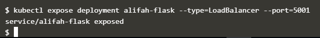

#KUBERNETES

Komponen-Komponen Kubernetes

1. Komponen Master

Komponen master menyediakan control plane bagi klaster. Komponen ini berperan dalam proses pengambilan secara global pada klaster, serta berperan dalam proses deteksi serta pemberian respons terhadap events yang berlangsung di dalam klaster.

Komponen master dapat dijalankan di mesin manapun yang ada di klaster. Meski begitu, untuk memudahkan proses yang ada, script inisiasi awal yang dijalankan biasanya memulai komponen master pada mesin yang sama, serta tidak menjalankan kontainer bagi pengguna di mesin ini.

kube-apiserver

Komponen di master yang mengekspos API Kubernetes. Merupakan front-end dari kontrol plane Kubernetes. Komponen ini didesain agar dapat di-scale secara horizontal. Lihat Membangun Klaster HA.

etcd

Penyimpanan key value konsisten yang digunakan sebagai penyimpanan data klaster Kubernetes.

kube-scheduler

Komponen di master yang bertugas mengamati pod yang baru dibuat dan belum di-assign ke suatu node dan kemudian akan memilih sebuah node dimana pod baru tersebut akan dijalankan. Faktor-faktor yang diperhatikan dalam proses ini adalah kebutuhan resource secara individual dan kolektif, konstrain perangkat keras/perangkat lunak/peraturan, spesifikasi afinitas dan non-afinitas, lokalisasi data, interferensi inter-workload dan deadlines.

kube-controller-manager

Komponen di master yang menjalankan kontroler. Secara logis, setiap kontroler adalah sebuah proses yang berbeda, tetapi untuk mengurangi kompleksitas, kontroler-kontroler ini dikompilasi menjadi sebuah binary yang dijalankan sebagai satu proses. Kontroler-kontroler ini meliputi:

Kontroler Node : Bertanggung jawab untuk mengamati dan memberikan respons apabila jumlah node berkurang.

Kontroler Replikasi : Bertanggung jawab untuk menjaga jumlah pod agar jumlahnya sesuai dengan kebutuhan setiap objek kontroler replikasi yang ada di sistem.

Kontroler Endpoints : Menginisiasi objek Endpoints (yang merupakan gabungan Pods dan Services).

Kontroler Service Account & Token: Membuat akun dan akses token API standar untuk setiap namespaces yang dibuat.

cloud-controller-manager

Cloud-controller-manager merupakan kontroler yang berinteraksi dengan penyedia layanan cloud. Kontroler ini merupakan fitur alfa yang diperkenalkan pada Kubernetes versi 1.6. Cloud-controller-manager hanya menjalankan iterasi kontroler cloud-provider-specific.

Adanya cloud-controller-manager memungkinkan kode yang dimiliki oleh penyedia layanan cloud dan kode yang ada pada Kubernetes saling tidak bergantung selama masa development. Pada versi sebelumnya, Kubernetes bergantung pada fungsionalitas spesifik yang disediakan oleh penyedia layanan cloud. Di masa mendatang, kode yang secara spesifik dimiliki oleh penyedia layanan cloud akan dipelihara oleh penyedia layanan cloud itu sendiri, kode ini selanjutnya akan dihubungkan dengan cloud-controller-manager ketika Kubernetes dijalankan.

Kontroler berikut ini memiliki keterkaitan dengan penyedia layanan cloud:

Kontroler Node : Melakukan pengecekan pada penyedia layanan cloud ketika menentukan apakah sebuah node telah dihapus pada cloud apabila node tersebut berhenti memberikan respons.

Kontroler Route : Melakukan pengaturan awal route yang ada pada penyedia layanan cloud.

Kontroler Service : Untuk membuat, memperbaharui, menghapus load balancer yang disediakan oleh penyedia layanan cloud.

Kontroler Volume : Untuk membuat, meng-attach, dan melakukan mount volume serta melakukan inetraksi dengan penyedia layanan cloud untuk melakukan orkestrasi volume.

2. Komponen Node

Komponen ini ada pada setiap node, fungsinya adalah melakukan pemeliharaan terhadap pod serta menyediakan environment runtime bagi Kubernetes.

kubelet

Agen yang dijalankan pada setiap node di klaster dan bertugas memastikan kontainer dijalankan di dalam pod.

kube-proxy

kube-proxy membantu abstraksi service Kubernetes melakukan tugasnya. Hal ini terjadi dengan cara memelihara aturan-aturan jaringan (network rules) serta meneruskan koneksi yang ditujukan pada suatu host.

Container Runtime

Container runtime adalah perangkat lunak yang bertanggung jawab dalam menjalankan kontainer. Kubernetes mendukung beberapa runtime, diantaranya adalah: Docker, containerd, cri-o, rktlet dan semua implementasi Kubernetes CRI (Container Runtime Interface).

Addons

Addons merupakan pod dan service yang mengimplementasikan fitur-fitur yang diperlukan klaster.

DNS

Meskipun tidak semua addons dibutuhkan, semua klaster Kubernetes hendaknya memiliki DNS klaster. Komponen ini penting karena banyak dibutuhkan oleh komponen lainnya.

Klaster DNS adalah server DNS, selain beberapa server DNS lain yang sudah ada di environment kamu, yang berfungsi sebagai catatan DNS bagi Kubernetes services

Kontainer yang dimulai oleh kubernetes secara otomatis akan memasukkan server DNS ini ke dalam mekanisme pencarian DNS yang dimilikinya.

Web UI (Dasbor)

Dasbor adalah antar muka berbasis web multifungsi yang ada pada klaster Kubernetes. Dasbor ini memungkinkan user melakukan manajemen dan troubleshooting klaster maupun aplikasi yang ada pada klaster itu sendiri.

Container Resource Monitoring

Container Resource Monitoring mencatat metrik time-series yang diperoleh dari kontainer ke dalam basis data serta menyediakan antar muka yang dapat digunakan untuk melakukan pencarian data yang dibutuhkan.

Cluster-level Logging

Cluster-level logging bertanggung jawab mencatat log kontainer pada penyimpanan log terpusat dengan antar muka yang dapat digunakan untuk melakukan pencarian.

Membuat Deployment dengan Python + Flask

Kubernetes Pod adalah grup yang terdiri dari satu atau lebih Container, yang saling terhubung untuk keperluan administrasi dan jaringan. Pod dalam praktik ini hanya memiliki satu Container. Deployment Kubernetes memeriksa kesehatan Pod dan memulai kembali (restart) Container Pod jika sudah berakhir atau mati. Deployment adalah cara yang disarankan untuk mengelola pembuatan dan replikasi Pod.

1.Membuat folder alifah-Flask.

  

2. Membuat file app.py.

  

3. Membuat file requirements.txt.

  

4. Membuat file Dockerfile.

  

5. Menjalankan docker build untuk membuat Image.

  

Upload ke hub.Docker
1. Login ke hub.docker.

  

2. Push image yang sudah di dibuat.

  

3. Melihat hasil Push.

  

Membuat Deployment menggunakan image python-flask
1. membuat Deployment.

  

2. Melihat Deployment yang sedang berjalan.

  

3. Melihat pods yang berjalan pada deployment tersebut.

  

Membuka port keluar
Secara default, Pod hanya bisa diakses melalui alamat IP internal di dalam cluster Kubernetes. Supaya Container python-flask bisa diakses dari luar jaringan virtual Kubernetes, saya harus ekspos Pod sebagai Service Kubernetes.
1. Ekspos Pod pada internet publik menggunakan perintah kubectl expose --type-LoadBalancer digunakan untuk ekspos Service keluar dari Cluster.

  

2. Melihat Service yang telah dibuat.

  

3. Melihat events.

  

4. Buka dengan menggunakan port 30175.

  
